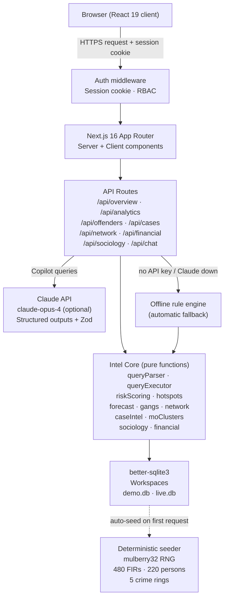

# DRISHTI — Architecture & Data Flow

## System Architecture

## Data Flow — One Copilot Query

This traces exactly what happens when an officer types *"Show theft cases in Mysuru this year"*.

1. **Browser → `/api/chat`** 
   The client component (`/copilot/page.tsx`) calls `POST /api/chat` with `{ message, history, workspace, role }`.

2. **Session guard** 
   The route reads the session cookie and verifies it using `verifySessionToken()`. Anonymous requests are rejected with 401.

3. **LLM or rule engine parse** (`src/lib/intel/llm.ts`, `queryParser.ts`) 
   - If `ANTHROPIC_API_KEY` is set: the message is sent to Claude with a structured-output schema. Claude returns a typed `QueryFilter` (`crimeType: "Theft"`, `district: "Mysuru"`, `fromDate: "2026-01-01"`).
   - If no key or Claude fails: the `parseQuery()` rule engine matches keywords/patterns with a deterministic regex/lookup cascade.

4. **Coerce for follow-ups** (`llmCoerce.ts`) 
   `isRefinement()` checks whether this message refines the previous query. If yes, the new filter is merged onto the prior one instead of replacing it.

5. **Execute** (`queryExecutor.ts`) 
   `executeQuery(db, filter)` builds and runs a parameterised SQLite query. Returns `{ kind: 'firs', firs: FirRecord[], totalCount, evidence }` where `evidence` is an array of FIR numbers (`["FIR/2026/001", ...]`).

6. **Compose response** (`llm.ts → composeAnswer`) 
   A human-readable answer string is composed from the query results. If the query was made in Kannada, the response is also in Kannada.

7. **Audit log** (`audit.ts`) 
   Every chat turn is recorded: `{ actor_role, action: 'copilot_query', detail: message, created_at }`.

8. **Response to browser** 
   `{ answer, evidence, confidence, engine: 'claude' | 'rule-engine', filter }` is returned. The Copilot UI renders the answer, collapsible evidence FIR refs, confidence bar, and the reasoning trail.

## Module Map

| DRISHTI Module | PRD Ref | Source |
|---|---|---|
| Natural-language querying | A1–A2 | `src/lib/intel/llm.ts`, `queryParser.ts` |
| Context retention | A2 | `llmCoerce.ts` |
| Kannada support | A3 | `llm.ts` language detection |
| Network graph + entity explorer | B1, B3 | `src/lib/intel/network.ts`, `/network` |
| Organized crime detection (rings) | B2 | `src/lib/intel/gangs.ts` |
| Temporal + geographic analytics | C1, C2 | `/analytics` |
| Hotspot detection | C3 | `src/lib/intel/hotspots.ts` |
| MO clustering (serial patterns) | C4 | `src/lib/intel/moClusters.ts` |
| Sociological intelligence | D | `src/lib/intel/sociology.ts`, `/sociology` |
| Offender profiling + risk scoring | E1–E3 | `src/lib/intel/riskScoring.ts`, `/offenders` |
| Investigator decision support | F1–F4 | `src/lib/intel/caseIntel.ts`, `/cases/[id]` |
| Financial intelligence (money-trail graph, ring detection) | G1–G3 | `src/lib/intel/financial.ts`, `/financial` |
| Forecasting + early warning | H1–H3 | `src/lib/intel/forecast.ts` |
| Explainable AI | I1–I3 | `/copilot` response cards |
| RBAC-lite | J1 | `src/lib/authShared.ts` |
| Audit logging | J2 | `src/lib/audit.ts`, `/audit` |

## QA Checklist

Execute this checklist in Chrome for each role. File failing items as GitHub Issues with screenshots.

### Roles and credentials
| Role | Username | Password |
|---|---|---|
| Investigator | `inv` | `demo` |
| Analyst | `analyst` | `demo` |
| Supervisor | `supervisor` | `demo` |
| Administrator | `admin` | `demo` |

### Pages to verify per role

- [ ] **`/overview`** — KPIs load; emerging hotspot alerts shown; recent FIRs list populates
- [ ] **`/copilot`** — Ask a question in English, get an answer with evidence FIR refs; ask in ಕನ್ನಡ; export CSV
- [ ] **`/network`** — Load a crime ring; click a member; expand to 3 hops
- [ ] **`/financial`** — Analyst/Supervisor/Admin only: transaction rings visible
- [ ] **`/analytics`** — Trend chart with dashed forecast; MO patterns card shows serial clusters; hotspot list with emerging badge
- [ ] **`/offenders`** — Filter High risk; risk score bars show factors
- [ ] **`/cases`** — Case list paginates; + New Case File button visible
- [ ] **`/cases/[id]`** — Summary, timeline, leads, similar cases; serial MO banner if applicable
- [ ] **`/sociology`** — District table + correlation callouts + disclaimer visible in both workspaces
- [ ] **`/audit`** — Supervisor/Admin only: all recent actions logged
- [ ] **Language toggle** — All pages translate to ಕನ್ನಡ; data values (FIR numbers, names) remain English
- [ ] **Workspace switch** — Demo workspace: 480 FIRs; Live workspace: starts empty, accepts new cases
